# Tech Progress
- Justin worked on scene lighting and our final presentation.
- Ed implemented a procedural flickering lamp material for the airship
and individual part animations which toggle after each is earned.
- Michael corrected some issues with player dashing, including
tuning resistance and launch distance, and removed the old testing
map from the sky.
- Zack implemented map checkpoints, allowing the player to reappear
near where they fall off the map, and placed them around the world.

# Art Progress
- Ethan remodeled and textured the map's pipes and rails,
redid the map topology and texturing for an organic appearance,
modeled new trees and foliage, touched up map materials to
remove placeholders, added a lamp to the airship, composed a
cave level theme, created dash and double jump animations,
and implemented Michael's jetpack model.

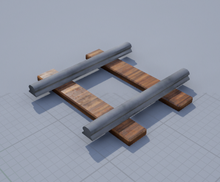
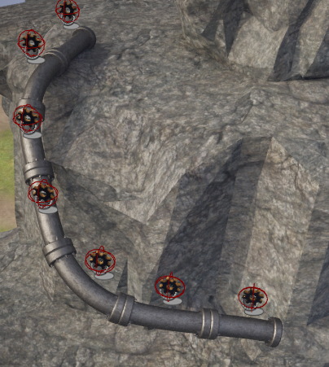
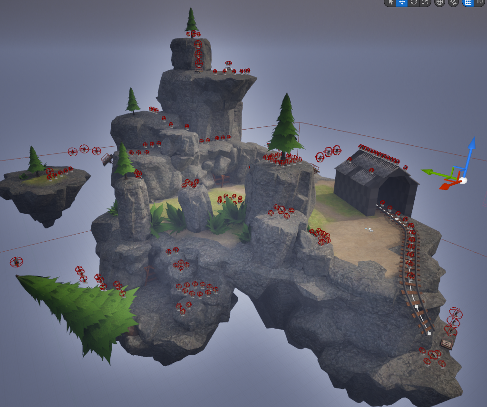
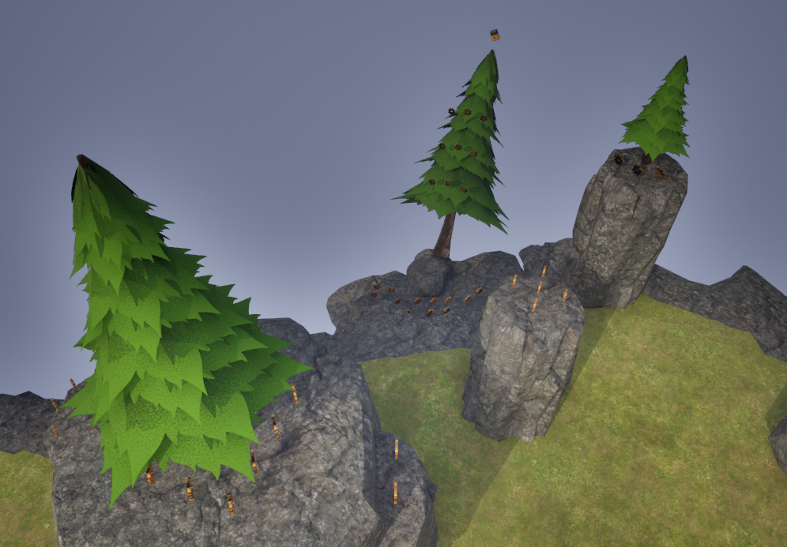
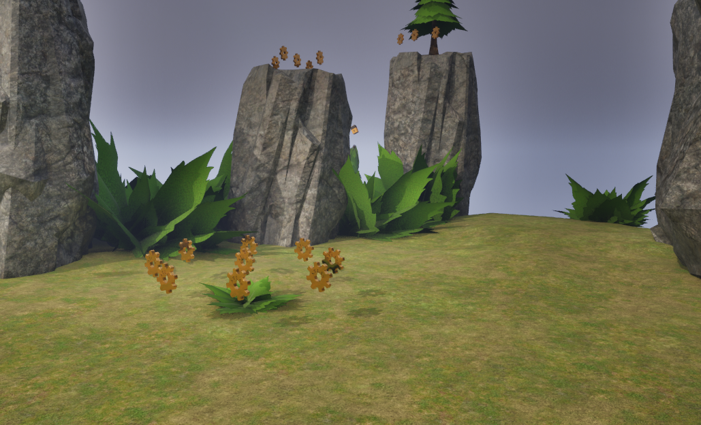
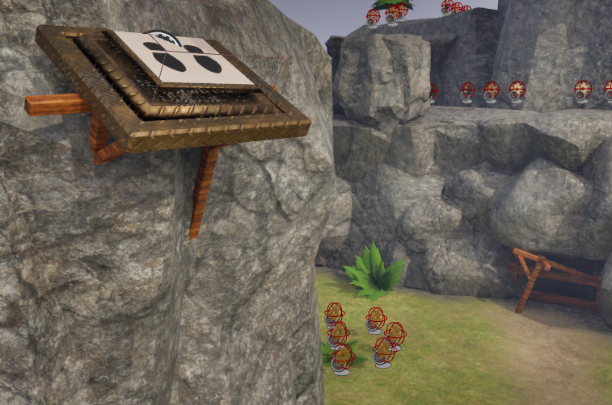
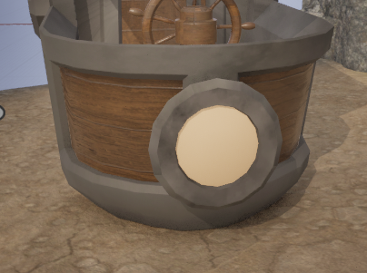

<audio controls="controls">
  <source type="audio/ogg" src="cave_theme.ogg"></source>
  
Your browser does not support the audio element.

</audio>

<video width="320" height="240" controls>
  <source src="dash.mp4" type="video/mp4">
Your browser does not support the video tag.
</video>

<video width="320" height="240" controls>
  <source src="double_jump.mp4" type="video/mp4">
Your browser does not support the video tag.
</video>

- Mingliang created the design for a 2D cave level, including
hazards and bounce pads.

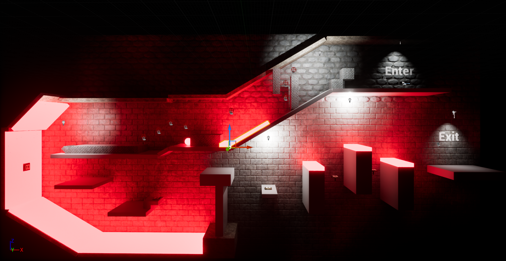

- Michael finished modeling, rigging, and texturing the NPC,
and modeled and textured the jetpack.

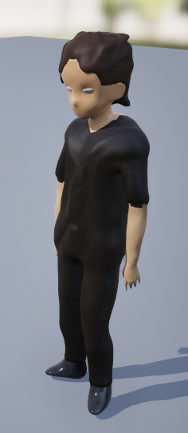
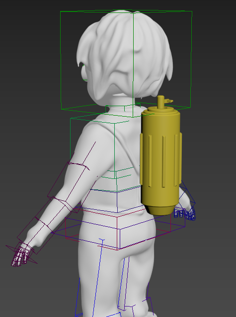
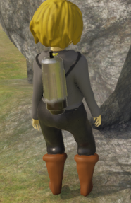