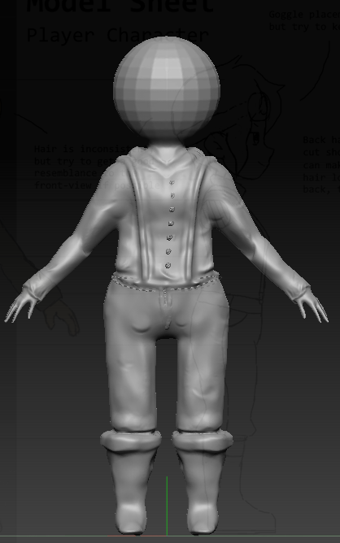
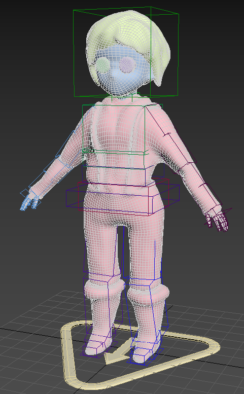
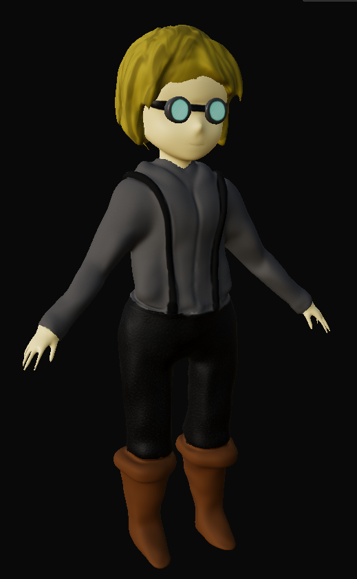
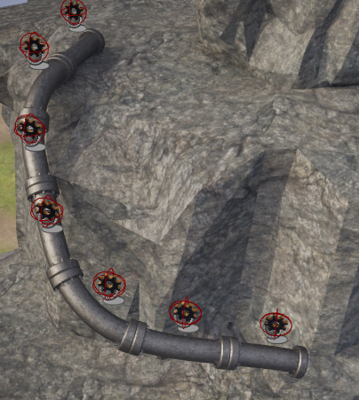

## Michael Weideman

Player Character Model: Sculpt Progress - *Michael Weideman*
  

Player Character Model: Rigging - *Michael Weideman*
  

Player Character Model: Texturing - *Michael Weideman*
  

## Ethan Chen

<audio controls="controls">
  <source type="audio/ogg" src="portfolio/ethan/Level Theme (Ethan).ogg"></source>
  
Your browser does not support the audio element.

</audio>

Level Theme - *Ethan Chen*
  

.gif)

Battery Animation - *Ethan Chen*
  

.webp)

Battery Rig: Materials - *Ethan Chen*
  

.png)

Concept: Island Geometry - *Ethan Chen*
  

.png)

Concept: Airship - *Ethan Chen*
  

.png)

Concept: Island Cave - *Ethan Chen*
  

.png)

Concept: Island Platforming notes - *Ethan Chen*
  

.gif)

Gear Animation - *Ethan Chen*
  

.webp)

Gear Rig: Materials - *Ethan Chen*
  

.webp)

Gear Rig: Skeleton and Skinning - *Ethan Chen*
  

.png)

Interactables Design - *Ethan Chen*
  

.webp)

Level Kit - *Ethan Chen*
  

.webp)

Level Modeling Second Pass - *Ethan Chen*
  

.webp)

Level Modeling Second Pass (Back View) - *Ethan Chen*
  

.png)

NPC Character Concept - *Ethan Chen*
  

.png)

Player Character Concept - *Ethan Chen*
  

.png)

Player Model Sheet - *Ethan Chen*
  

.webp)

Splines (Pipes & Tracks) - *Ethan Chen*
  

Airship: Model - *Ethan Chen*
  

Airship: Textured Materials - *Ethan Chen*
  

Airship: Idle Animation - *Ethan Chen*
  

Leaf Texture - *Ethan Chen*
  

.png)

Tree Model (Polygons) - *Ethan Chen*
  

.png)

Tree Model (without modifiers) - *Ethan Chen*
  

Tree Model - *Ethan Chen*
  

Tree Model (in Engine) - *Ethan Chen*
  

Bush Model - *Ethan Chen*
  

Bush Model (in Engine) - *Ethan Chen*
  

Rock Platform Remesh Process - *Ethan Chen*
  

.png)

Rock Pillar Remesh Start - *Ethan Chen*
  

.png)

Rock Pillar Remesh End - *Ethan Chen*
  

.png)

Rock Pillar Remesh End - *Ethan Chen*
  

Metal Pipe Retexture - *Ethan Chen*
  

Metal Plate Retexture - *Ethan Chen*
  

Remodeled Track Segment - *Ethan Chen*
  

Overview of Remeshed Island - *Ethan Chen*
  

<audio controls="controls">
  <source type="audio/wav" src="portfolio/ethan/Battery_Collect.wav"></source>
  
Your browser does not support the audio element.

</audio>

Battery Collect SFX - *Ethan Chen*
  

<audio controls="controls">
  <source type="audio/wav" src="portfolio/ethan/BouncePad_Sprung.wav"></source>
  
Your browser does not support the audio element.

</audio>

Bounce Pad SFX - *Ethan Chen*
  

<audio controls="controls">
  <source type="audio/wav" src="portfolio/ethan/Gear_Collect.wav"></source>
  
Your browser does not support the audio element.

</audio>

Gear Collect SFX - *Ethan Chen*
  

<audio controls="controls">
  <source type="audio/wav" src="portfolio/ethan/Player_Dash.wav"></source>
  
Your browser does not support the audio element.

</audio>

Player Dash SFX - *Ethan Chen*
  

<audio controls="controls">
  <source type="audio/wav" src="portfolio/ethan/Player_DoubleJump.wav"></source>
  
Your browser does not support the audio element.

</audio>

Player Double-Jump SFX - *Ethan Chen*
  

<audio controls="controls">
  <source type="audio/wav" src="portfolio/ethan/Player_Jump.wav"></source>
  
Your browser does not support the audio element.

</audio>

Player Jump SFX - *Ethan Chen*
  

<audio controls="controls">
  <source type="audio/wav" src="portfolio/ethan/Player_Movement_Upgrade.wav"></source>
  
Your browser does not support the audio element.

</audio>

Player Movement Upgrade SFX - *Ethan Chen*
  

<audio controls="controls">
  <source type="audio/wav" src="portfolio/ethan/Ship_Repair.wav"></source>
  
Your browser does not support the audio element.

</audio>

Ship Repair SFX - *Ethan Chen*
  

<audio controls="controls">
  <source type="audio/wav" src="portfolio/ethan/Victory.wav"></source>
  
Your browser does not support the audio element.

</audio>

Victory SFX - *Ethan Chen*
  

<audio controls="controls">
  <source type="audio/ogg" src="portfolio/ethan/cave_theme.ogg"></source>
  
Your browser does not support the audio element.

</audio>

Cave Music - *Ethan Chen*
  

## Mingliang Wang

Greybox - *Mingliang Wang*
  

UI & Animation - *Mingliang Wang*
  

Rotrating Battery SpriteSheet - *Mingliang Wang*
  

UI Background - *Mingliang Wang*
  

\
\
---
